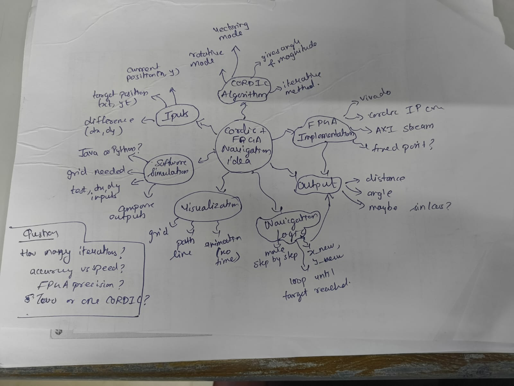
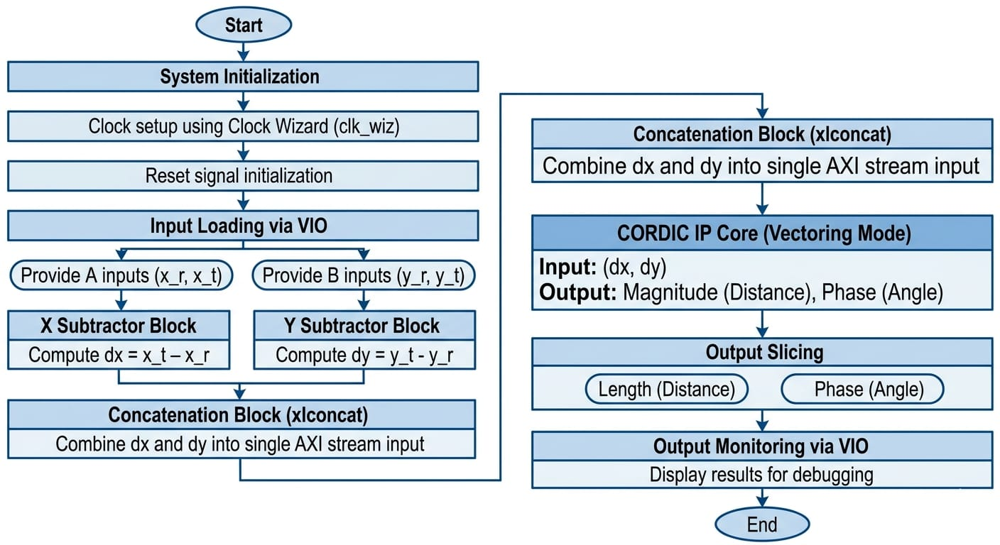
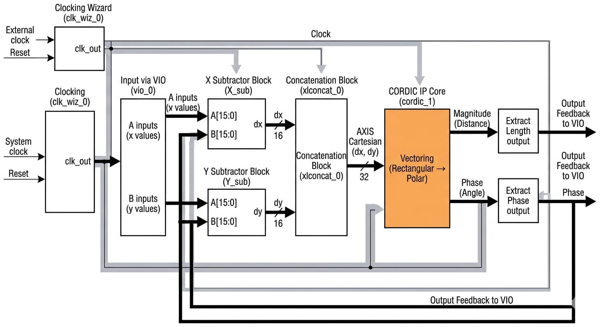
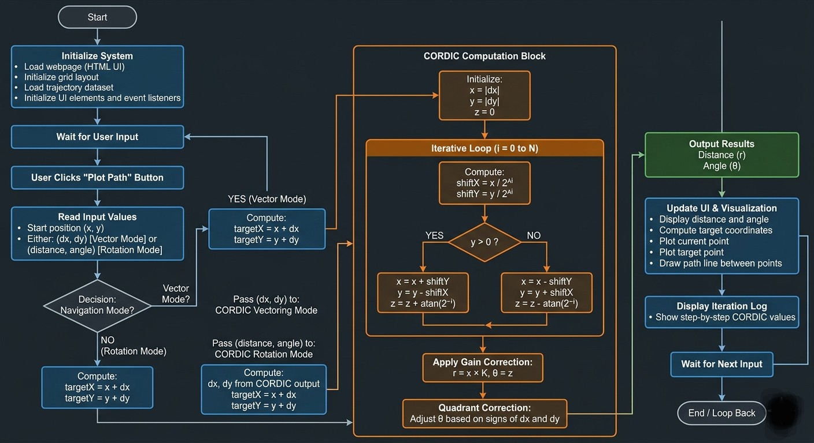
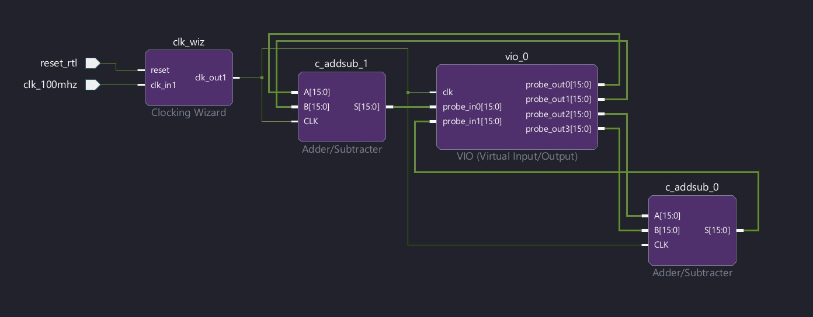
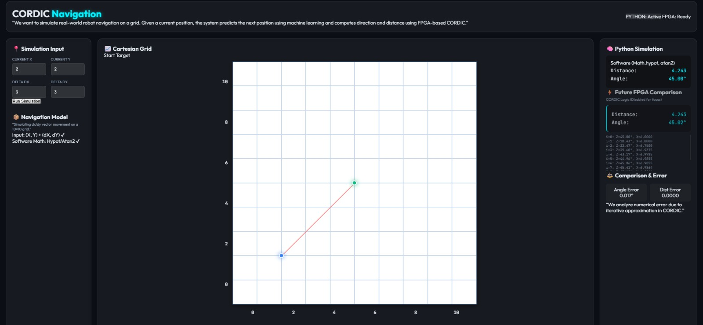
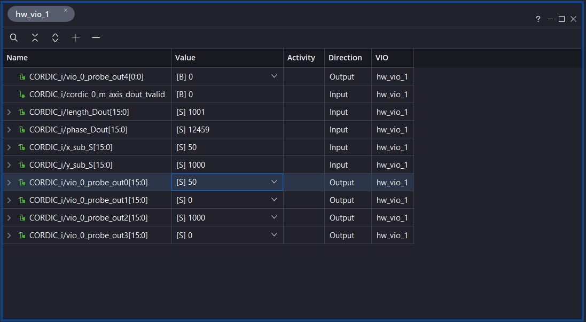
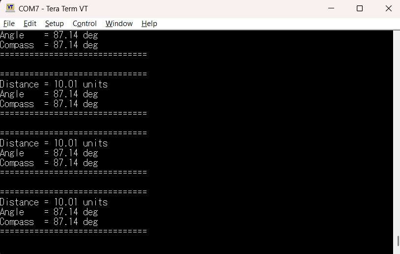
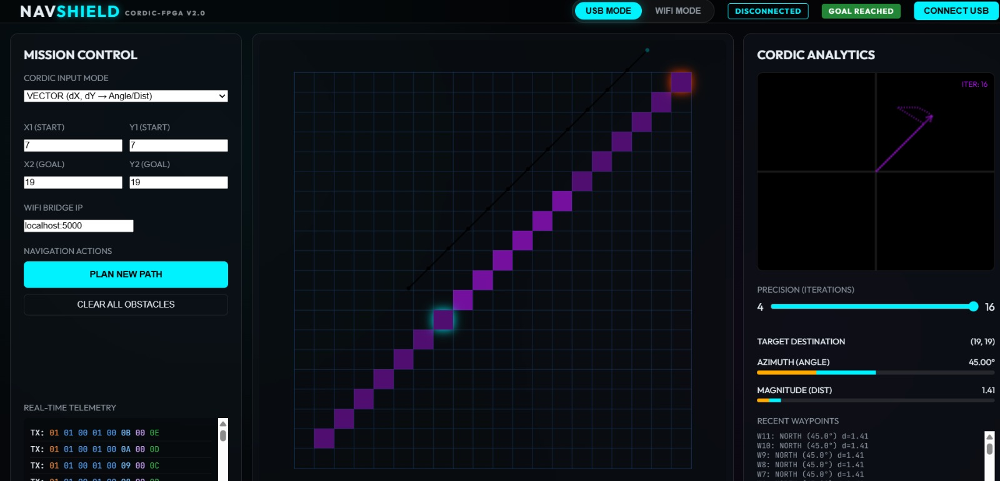

# SKILL LAB PRATICAL HACKATHON

## Final Project README

> **Project Weight:** 100%  
> **Team Size:** 4 students  
> **Project Duration:** 16 hours  
> **Total Time Available:** 32 effort-hours per team  
> **Project Type:** Playful, interactive, technology-based experience

---

# Before you begin

## Fork and rename this repository

After forking this repository, rename it using the format:

`SKILLLAB_PROR-2026-TeamName`

### Example

`SKILLLAB_PROR-2026-AuroWizards`

Do not keep the default repository name.

---

# How to use this README

This file is your team’s **working project document**.

You must keep updating it throughout the build period.  
By the final review, this README should clearly show:

- your idea,
- your planning,
- your design decisions,
- your technical process,
- your build progress,
- your testing,
- your failures and changes,
- your final outcome.

## Rules

- Fill every section.
- Do not delete headings.
- If something does not apply, write `Not applicable` and explain why.
- Add images, screenshots, sketches, links, and videos wherever useful.
- Update task status and weekly logs regularly.
- Use this file as evidence of process, not only as a final report.

---

# 1. Team Identity

## 1.1 Studio / Group Name

`Team Encoders`

## 1.2 Team Members

| Name                  | Primary Role                    | Secondary Role   | Strengths Brought to the Project |
| --------------        | ------------------------------- | --------------   | -------------------------------- |
| `Vijay Prabhu` | `[Electronics / Designing ]` | `[Research]`  | `Hardware`|
| `Parth Bhosale`        | `[Electronics / Designing]`   | `[Coding]`       | `Hardware`    |
| `Kushith Shetty`        | `[Software/Simulation]`   | `[Coding]`       | `Software`    |
| `Nafeesa Memon`        | `[Software/Documentation]`   | `[Research]`       | `Software`    |

## 1.3 Project Title

`"FPGA-Based Robotic Navigation using CORDIC Algorithm"`


## 1.4 One-Line Pitch

`A real-time robotic navigation system that computes direction and distance using FPGA-accelerated CORDIC instead of traditional CPU-based math.`

## 1.5 Expanded Project Idea

In 1–2 paragraphs, explain:

- what your project is,
- what kind of experience it creates,
- what technologies are involved.

**Response:**  
`This project presents a hardware-accelerated robotic navigation system implemented on FPGA using the CORDIC (Coordinate Rotation Digital Computer) algorithm. The system computes direction and distance between a robot’s current position and a target location in real time using only shift-add operations, eliminating the need for multipliers and floating-point computation.
A complementary software simulation environment was developed using JavaScript to validate the algorithmic behavior and visualize navigation on a Cartesian grid. The system continuously calculates displacement, converts it into polar coordinates using CORDIC, and updates the robot’s position iteratively until the destination is reached. This approach demonstrates how computationally intensive mathematical operations can be efficiently mapped to hardware for deterministic and low-latency performance.`

---

# 2. Inspiration

## 2.1 References

List what inspired the project.

| Source Type | Title / Link                                                        | What Inspired You                                                                         |
| ----------- | ------------------------------------------------------------------- | ----------------------------------------------------------------------------------------- |
| `[Research Paper]`   | `https://ieeexplore.ieee.org/stamp/stamp.jsp?tp=&arnumber=7030598&tag=1` | `How the CORDIC algorithm can be efficiently implemented on FPGA to perform real-time robotic navigation computations using hardware-friendly operations.` |
|             |                                                                     |                                                                                           |
|             |                                                                     |                                                                                           |

## 2.2 Original Twist

What makes your project original?

**Response:**  
Unlike conventional robotic navigation systems that rely on CPUs or microcontrollers for trigonometric computations, this project offloads all critical mathematical operations to FPGA hardware using the CORDIC algorithm.

Additionally, the project integrates:
- A hardware-software co-design approach
- A real-time visualization interface
- Error comparison between software math and FPGA-equivalent computation
This combination of FPGA acceleration with interactive simulation makes the system both technically efficient and conceptually demonstrative.

---

# 3. Project Intent

## 3.1 User Journey 

Describe exactly how a user will use the project.Make it a story
**Response:**  
The user interacts with the system through a simulation interface. They input the current position (x,y) and displacement (dx,dy). Once the simulation is triggered, the system visually plots the current and target positions on a grid.
Internally, the system computes direction and distance using both:
- standard mathematical functions (software), and
- CORDIC-based iterative computation (hardware equivalent)
The computed path is displayed as a vector, and the robot’s movement is simulated step-by-step. The interface also shows numerical outputs such as distance, angle, and error metrics, allowing the user to understand both the navigation process and the accuracy of the CORDIC algorithm.
                                                  |


---

# 4. Definition of Success

## 4.1 Definition of “Usable”

A “usable” version of this project is one in which the system successfully accepts coordinate inputs, computes displacement using the CORDIC algorithm, and produces accurate direction (angle) and distance outputs, along with a clear visual representation of the navigation on the grid, allowing the user to understand and verify the computation process.

## 4.2 Minimum Usable Version

What is the smallest version of this project that still delivers the core experience?

**Response:**  
The minimum usable version of the project includes:
- Input of current and target coordinates
- Computation of displacement vector (dx, dy)
- CORDIC-based calculation of angle and distance
- Basic visualization of movement on a grid
- Display of numerical outputs
This version demonstrates the core concept of FPGA-based navigation computation.

## 4.3 Stretch Features

What features are nice to have but not essential?

- Closed-loop navigation system
- Sensor integration (IMU / encoders)
- Obstacle detection and avoidance
- Autonomous path planning

---

# 5. System Overview

## 5.1 Project Type

Check all that apply.

- [x] Electronics-based

- [x] Mechanical

- [ ] Sensor-based

- [ ] App-connected

- [ ] Motorized

- [ ] Sound-based

- [ ] Light-based

- [x] Screen/UI-based

- [ ] Fabricated structure

- [ ] Game logic based

- [ ] Installation

- [ ] Other:

## 5.2 High-Level System Description

Explain how the system works in simple terms.

Include:

- input
- processing,
- output,
- physical structure,
- app interaction if any.

**Response:**  
- Input      - Robot’s current position and a target position
- Processing - A displacement vector is generated using subtractor logic. This vector is then processed using a CORDIC module configured                          in vectoring mode to compute distance and direction.The computed angle is further used in a second CORDIC module (rotation                         mode) to generate cosine and sine values. These values are scaled using a velocity factor and added to the current                                 position to generate the next position.
- Output     - This process is repeated iteratively until the robot reaches the target.
- Physical
  structure  - The system is implemented in FPGA hardware.
- App
  interaction- A software simulation replicates the same logic for validation and visualizatio

## 5.3 Input / Output Map
| System Part            | Type       | What It Does                                      |
|:-----------------------|:----------:|--------------------------------------------------:|
| Position Input         | Input      | Takes current (x, y) and target coordinates       |
| Subtractor Block       | Processing | Computes dx, dy                                   |
| CORDIC (Vectoring)     | Processing | Computes angle and distance                       |
| CORDIC (Rotation)      | Processing | Computes sin and cos                              |
| Update Logic           | Processing | Calculates next position                          |
| Comparator             | Processing | Checks if target is reached                       |
| Visualization UI       | Output     | Displays path, angle, distance, error             |


---

# 6. System Design, Sketches and Visual Planning 

## 6.1 Concept Architecture/sketch/schematic

Add an early sketch of the full idea.

**Insert image below:**  
<p align="center">
  
</p>

Example:

```md

```


## 6.2 Labeled Build Sketch/architecture/flow diagram/algorithm

Add a sketch with labels showing:

- structure,
- electronics placement,
- user touch points,
- moving parts,
- output elements.

**Insert image below:**  
<p align="center">
  
</p>


## 6.3 Approximate Dimensions  (NOT APPLICABLE because we dont have a physical product, the algorithm is implemented on a boolean board)

| Dimension        | Value   |
| ---------------- | ------- |
| Length           | `16 cm` |
| Width            | `16 cm` |
| Height           | `8 cm`  |
| Estimated weight | `400 g` |

---

# 7. Electronics Planning

## 7.1 Electronics Used

| Component                 | Quantity | Purpose                               |
| ------------------------- | --------:| ------------------------------------- |
| `[FPGA]`                 | `1`      | `[Main controller]`                   |


## 7.2 Wiring Plan

Describe the main electrical connections.

**Response:**  
`The FPGA (Xilinx-based development board) serves as the central processing unit of the system. A clock signal generated using the clock wizard module is distributed to all synchronous blocks to ensure coordinated operation.

Input coordinate values are provided through a Virtual Input/Output (VIO) interface, allowing real-time testing and modification of inputs such as current and target positions. These inputs are routed to two subtractor blocks, which compute the displacement components dx and dy.

The outputs of the X and Y subtractors are connected to a concatenation block (xlconcat), which combines them into a single data stream compatible with the AXI-Stream interface of the CORDIC IP core.

A single CORDIC IP core is used, configured in Translate (Vectoring) mode, which converts the Cartesian inputs (dx,dy) into polar outputs — namely, magnitude (distance) and phase (angle). This eliminates the need for a second CORDIC block.

The CORDIC outputs are passed through slice blocks to separate and extract the distance and angle values. These outputs are then routed back to the VIO module for observation and verification.

All data transfers between blocks follow AXI-Stream protocol with valid/ready handshaking to ensure proper synchronization and continuous data flow through the pipeline.

The design follows a linear dataflow architecture with minimal control complexity, making it efficient and well-suited for FPGA-based implementation of the CORDIC algorithm.`

## 7.3 Circuit Diagram/architecture diagram

Insert a hand-drawn or software-made circuit diagram.

**Insert image below:**  
<p align="center">
  
</p>


# 7.4. Power Plan

| Question               | Response                                                                 |
|-----------------------|--------------------------------------------------------------------------|
| Power source          | `External DC supply via FPGA development board (USB or adapter)`         |
| Voltage required      | `Typically 5V input to FPGA board, internally regulated (3.3V, 1.8V)`    |
| Current concerns      | `Stable current required for FPGA logic switching and CORDIC IP operation` |
| Safety concerns       | `Avoid over-voltage, ensure proper grounding, prevent short circuits`     |
| Power regulation      | `On-board regulators provide stable voltage to FPGA fabric and IP cores` |
| FPGA-specific concern | `Power stability is critical to avoid timing errors in CORDIC computation` |

---

# 8. Software Planning/

## 8.1 Software Tools

| Tool / Platform                | Purpose                                        |
| ------------------------------ | ---------------------------------------------- |
| `[Xilinx Vivado]`              | `[FPGA design and CORDIC IP integration]`      |
| `[JavaScript (HTML/CSS)]`      | `[Simulation and visualization]`               |
| `[CORDIC JS Model]`            | `[FPGA-equivalent computation]`                |
| `[CORDIC JS Model]`            | `[Real-time debugging]`                        |

## 8.2 Software Logic/Algorithm

Describe what the code must do.

Include:

- startup behavior,
- input handling,
- sensor reading,
- decision logic,
- output behavior,
- communication logic,
- reset behavior.

**Response:**  
`
- **Startup behavior:**  
  The FPGA initializes the system clock using the clock wizard and configures all internal modules including subtractor blocks, concatenation logic, and the CORDIC IP core. The VIO interface is enabled for real-time input and output monitoring.

- **Input handling:**  
  The system accepts coordinate inputs through the VIO module:
  
  (x1, y1), (x2, y2)

- **Sensor reading:**  
  Not applicable, as the system operates on user-provided inputs via VIO.

- **Computation logic:**  
  The subtractor blocks compute displacement:

  dx = x2 - x1  
  dy = y2 - y1  

  These values are fed into the CORDIC IP core (Translate / Vectoring mode), which computes:

  r = sqrt(dx² + dy²)  
  θ = atan(dy / dx)  

  Internally, the CORDIC algorithm performs iterative shift-add operations:

  x(i+1) = x(i) ± y(i) / 2^i  
  y(i+1) = y(i) ∓ x(i) / 2^i  
  z(i+1) = z(i) ± atan(2^(-i))  

- **Decision logic:**  
  The system performs direct computation without branching, focusing on accurate coordinate transformation.

- **Output behavior:**  
  The outputs:

  Distance = r  
  Angle = θ  

  are extracted using slice blocks and displayed through the VIO interface.

- **Communication logic:**  
  AXI-Stream interfaces with valid/ready handshaking ensure synchronized data transfer between modules.

- **Reset behavior:**  
  Upon reset, all registers and intermediate states are cleared, and the system returns to an idle state ready for new inputs.`

## 8.3 Code Flowchart

Insert a flowchart showing your code logic.

Suggested sequence:

- start,
- initialize,
- wait for input,
- read input,
- decision,
- trigger output,
- repeat or reset,
- error handling.

**Insert image below:**  
<p align="center">
  
</p>


# 9. Bill of Materials

## 9.1 Full BOM

| Item                             | Quantity | In Kit? | Need to Buy? | Estimated Cost | Material / Spec               | Why This Choice?          |
| -------------------------------- | --------:| ------- | ------------ | --------------:| ----------------------------- | ------------------------- |
| `[FPGA]`                        | `1`      | `Yes`   | `No`         | `0`            | `Spartan7`                | `[To implement algorithm]` |


## 9.2 Material Justification

Explain why you selected your main materials and components.

**Response:**  
`An FPGA (Xilinx-based development board) was selected as the main component due to its ability to perform high-speed parallel computation, which is essential for efficiently implementing the CORDIC algorithm using shift-add operations instead of multipliers.`


## 9.3 Items You chose( NOT APPICABLE)

| Item                 | Why Needed               | Purchase Link | Latest Safe Date to Procure | Status       |
| -------------------- | ------------------------ | ------------- | --------------------------- | ------------ |
| `BO Motors + Wheels` | `Drive system for car`   | `robu.in`     | `15th April`                | `[Received]` |
| `Buck Converter`     | `Stable power for ESP32` | `local store` | `before testing`            | `[Received]` |
| `Li-ion Batteries`   | `Portable power`         | `local store` | `before testing`            | `Recieved`   |

## 9.4 Budget Summary

| Budget Item           | Estimated Cost              |
| --------------------- | ---------------------------:|
| Electronics           | `[0 (Available on campus)]`                     |
| Mechanical parts      | `[0]`                       |
| Fabrication materials | `[0]`                       |
| Purchased extras      | `[0]`                       |
| Contingency           | `[0]`                       |
| **Total**             | `[0]`                       |

## 9.5 Budget Reflection

If your cost is too high, what can be simplified, removed, substituted, or shared?

**Response:**  
NOT APPLICABLE as our budget is negligible.
---

# 10. Planning the Work

## 10.1 Team Working Agreement

Write how your team will work together.

Include:

- how tasks are divided,
- how decisions are made,
- how progress will be checked,
- what happens if a task is delayed,
- how documentation will be maintained.

**Response:**  
 `The team followed a structured and role-based approach to ensure efficient progress within the limited time frame. Responsibilities were divided based on individual strengths:
- Vijay and  Parth: FPGA design and CORDIC implementation
- Nafeesa: Documentation, GitHub management, and Software support
- Kushith: Software simulation and visualization

Decisions were made collaboratively after brief discussions, especially for design choices affecting both hardware and software. Progress was reviewed periodically by syncing outputs from FPGA logic and simulation.
If a task was delayed, responsibilities were redistributed temporarily to maintain overall progress. Documentation was updated continuously on GitHub to ensure transparency and track development.` 

## 10.2 Task Breakdown

| Task ID | Task                        | Owner       | Estimated Hours | Deadline | Dependency | Status |
| ------- | --------------------------- | ----------- | --------------- | -------- | ---------- | ------ |
| T1      | Understand CORDIC algorithm | All         | 1               | Day 1    | None       | Done   |
| T2      | FPGA block design           | Vijay, Parth| 2               | Day 1    | T1         | Done   |
| T3      | CORDIC implementation       | Vijay, Parth| 3               | Day 1    | T2         | Done   |
| T4      | Software simulation (JS)    | Kushith     | 6               | Day 1    | T1         | Done   |
| T5      | Integration + validation    | All         | 4               | Day 1    | T3, T4     | Done   |
| T6      | Documentation & GitHub      | Nafeesa     | 5               | Day 1    | All        | Done   |


## 10.3 Responsibility Split

| Area                | Main Owner | Support Owner |
| ------------------- | ---------- | ------------- |
| Concept             | Vijay      | All           |
| Electronics (FPGA)  | Vijay      | Parth         |
| Coding (FPGA)       | Parth      | Vijay         |
| Software Simulation | Kushith    | Nafeesa       |
| Testing             | Nafeesa    | All           |
| Documentation       | Nafeesa    | All           |

---

# 11 hour Milestones

## 11.1 8-hour Plan(tentetively you may set)

### Bi Hour 1 — Plan and De-risk

Expected outcomes:

- [x] Idea finalized
- [x] Core interaction decided
- [x] Sketches made
- [x] BOM completed
- [x] Purchase needs identified
- [ ] Key uncertainty identified
- [x] Basic feasibility tested

### Bi Hour 2 — Build Subsystems

Expected outcomes:

- [x] Electronics tests completed
- [ ] CAD / structure planning completed
- [ ] App UI started if needed
- [x] Mechanical concept tested
- [x] Main subsystems partially working

### Bi Hour 3 — Integrate

Expected outcomes:

- [x] Physical body built
- [x] Electronics integrated
- [x] Code connected to hardware
- [ ] App connected if required
- [x] First playable version exists

### Bi Hour 4 — Refine and Finish

Expected outcomes:

- [x] Technical bugs reduced
- [x] Playtesting completed
- [x] Improvements made
- [x] Documentation completed
- [x] Final build ready

## 12.2  Update Log

| Day   | Planned Goal                  | What Actually Happened                     | What Changed                   | Next Steps           |
| ----- | ----------------------------- | ------------------------------------------ | ------------------------------ | -------------------- |
| Bi hour 1 | Understand CORDIC + design    | Algorithm studied and architecture decided | Added simulation idea          | Start FPGA + JS work |
| Bi hour 2 | FPGA implementation           | Basic CORDIC working in simulation         | Needed more iterations tuning  | Improve accuracy     |
| Bi hour 3 | Simulation + integration      | JS simulation completed                    | Added error comparison feature | Validate results     |
| Bi hour 4 | Final testing + documentation | Outputs verified and README completed      | Improved visualization clarity | Final submission reaady     |

---

# 13. Risks and Unknowns

## 13.1 Risk Register

| Risk                            | Type       | Likelihood | Impact | Mitigation Plan                |
| ------------------------------- | ---------- | ---------- | ------ | ------------------------------ |
| Incorrect CORDIC implementation | Technical  | Medium     | High   | Validate with software outputs |
| Fixed-point precision errors    | Technical  | Medium     | Medium | Tune iterations and scaling    |
| FPGA integration issues         | Technical  | Low        | High   | Test modules independently     |
| Time constraints                | Management | Medium     | Medium | Divide tasks efficiently       |


## 13.2 Biggest Unknown Right Now

What is the single biggest uncertainty in your project at this stage?

**Response:**  
`The biggest uncertainty was ensuring that the iterative CORDIC algorithm produces sufficiently accurate results within a limited number of iterations while maintaining hardware efficiency. Balancing precision and performance required careful tuning and validation.`

---

# 14. Testing 

## 14.1 Technical Testing Plan

| What Needs Testing     | How You Will Test It              | Success Condition             |
| ---------------------- | --------------------------------- | ----------------------------- |
| CORDIC accuracy        | Compare with Math.hypot & atan2   | Minimal error between outputs |
| Iterative convergence  | Run multiple input values         | Output stabilizes correctly   |
| FPGA logic correctness | Test using VIO inputs             | Expected outputs observed     |
| Simulation consistency | Compare JS vs theoretical results | Matching behavior             |

## 14.2 Testing and Debugging Log

| Date  | Problem Found              | Type      | What You Tried          | Result   | Next Action         |
| ----- | -------------------------- | --------- | ----------------------- | -------- | ------------------- |
| Bi hour 2| Incorrect angle output     | Technical | Checked iteration logic | Fixed    | Validate more cases |
| Bi hour 3 | Slight distance mismatch   | Precision | Increased iterations    | Improved | Optimize scaling    |
| Bi hour 3 | Visualization misalignment | UI        | Adjusted grid mapping   | Fixed    | Final testing       |


## 14.3 Playtesting Notes

| Tester | What They Did           | What Confused Them      | What They Enjoyed          | What You Will Change      |
| ------ | ----------------------- | ----------------------- | -------------------------- | ------------------------- |
| Nafeesa | Tested different inputs | Iteration logs unclear  | Visual path representation | Improve iteration display |
| Kushith | Checked accuracy        | Minor value differences | Error comparison feature   | Add explanation notes     |


---

# 15. Build Documentation

## 15.1 Fabrication Process(if any) (NOT APPLICABLE)

Describe how the project was physically made.

Include:

- cutting,
- 3D printing,
- assembly,
- fastening,
- wiring,
- finishing,
- revisions.

**Response:**  
`The fabrication process involved designing, manufacturing, assembling, and refining both the physical structure and electronic integration of the system.`

`Design (CAD Modeling):
The initial model was created using CAD software, where components were designed based on the actual dimensions of the electronic parts. This ensured accurate fitting and minimized errors during assembly.
Cutting (Laser Cutting):
The designed parts were fabricated using laser cutting techniques. Sheets were cut precisely according to the CAD model to create the structural base and mounts for components.`

`Components were fixed using adhesives and mechanical supports. Certain parts were intentionally kept modular (not permanently fixed) to allow easy replacement and modification of electronics.
Surface Finishing:
Some parts were sanded to smooth rough edges after cutting. Sawdust mixed with adhesive was used to fill gaps and uneven edges, improving structural finish. The final structure was then painted for better aesthetics and durability.`

`Environment Setup (Dark Room Fabrication):
To enhance projection visibility, a controlled dark environment was created using Z-boards, paper sheets, and bedsheets. This minimized external light interference and improved projection clarity.
Revisions and Iterations:
Multiple adjustments were made throughout the process, including refining alignment, improving structural stability, repositioning components, and optimizing the interaction between the physical car and projected environment.`

## 16 Build Photos

Add photos throughout the project.

Suggested images:

- early sketch,
- prototype,
- electronics testing,
- mechanism test,
- app screenshot,
- final build.
- The first block design we made
 <p align="center">
  
</p> 
-First software trial
<p align="center">
  
</p> 
- The subractor block we made to get started
<p align="center">
  
</p>
-The subractor block we made to get started
<p align="center">
  
</p> 
-The subractor block virtual input output table
<p align="center">
  
</p> 

# 17. Final Outcome

## 17.1 Final Description

Describe the final version of your project.

**Response:**  
`The final system successfully demonstrates FPGA-based robotic navigation using the CORDIC algorithm. The design computes direction and distance in real time and updates position iteratively using hardware-efficient operations.
The accompanying software simulation provides a clear visualization of the navigation process and validates the accuracy of the CORDIC algorithm. The results show minimal deviation from standard mathematical computations, proving the effectiveness of the approach.`

-The current virtual input output table
<p align="center">
  
</p> 

-The current block design
<p align="center">
  
</p> 

-The output dashboard
<p align="center">
  
</p> 

-The software simulation
<p align="center">
  
</p> 


## 17.2 What Works Well
`1)Accurate CORDIC computation
2)Smooth visualization of navigation
3)Clear comparison between software and hardware logic
4)Efficient FPGA-friendly design`


## 17.3 What Still Needs Improvement

`1)Full hardware deployment with physical robot
2)Better fixed-point precision tuning
3)Pipeline optimization
4)Real sensor integration`


## 17.4 What Changed From the Original Plan

How did the project change from the initial idea?

**Response:**  
`The project was originally defined around implementing the CORDIC algorithm on FPGA for computing trigonometric functions such as angle and magnitude from Cartesian inputs. As development progressed, the scope was refined to place stronger emphasis on system-level understanding and validation of the algorithm rather than just isolated implementation.
To achieve this, a software simulation layer was introduced alongside the hardware design. This allowed step-by-step visualization of CORDIC iterations, comparison with standard mathematical functions, and detailed error analysis. The addition of this validation framework significantly improved debugging, interpretation of results, and confidence in the FPGA-oriented design.`


---

# 18. Reflection

## 18.1 Team Reflection

What did your team do well?  
What slowed you down?  
How well did you manage time, tasks, and responsibilities?

**Response:**  
`The team worked well in terms of dividing responsibilities between hardware understanding, algorithm implementation, and documentation. Communication was consistent, which helped in aligning both the FPGA design and the software simulation aspects of the project.
The main challenges were related to understanding the CORDIC algorithm deeply and mapping it correctly to both hardware logic and software simulation. Debugging iterative computations and ensuring consistency between expected and observed outputs also required additional time.
Overall, time and tasks were managed reasonably well. Initial planning helped in covering core objectives early, and later efforts were focused on refinement, testing, and improving clarity of the implementation.`


## 18.2 Technical Reflection

What did you learn about:

- electronics,
- coding,
- mechanisms,
- fabrication,
- integration?

**Response:**  
`This project provided deep insights into:
1)FPGA-based system design
2)Fixed-point arithmetic
3)Hardware implementation of mathematical algorithms
4)Trade-offs between accuracy and resource usage
5)Integration of hardware and software systems`


## 18.3 Design Reflection

What did you learn about:

- designing ,
- delight,
- clarity,
- physical interaction,
- understanding,
- iteration?

**Response:**  
`This project helped in understanding the importance of designing systems with clarity and purpose. Breaking down a complex algorithm like CORDIC into smaller logical stages made the implementation more manageable and easier to debug.
From a clarity perspective, visualizing outputs through simulation significantly improved understanding of how the algorithm behaves iteratively. It also highlighted the importance of representing technical concepts in an interpretable way.
In terms of interaction, even though the system is primarily computational, the addition of a visual interface made the project more intuitive and easier to analyze.`


## 18.4 If You Had One More hour

What would you improve next?

**Response:**  

`The process reinforced that good design is iterative. Initial approaches were refined multiple times to improve accuracy, structure, and usability. Small improvements in representation and logic led to a much clearer and more reliable final system. `

---

# 19. Final Submission Checklist

Before submission, confirm that:

- [x] Team details are complete
- [x] Project description is complete
- [x] Inspiration sources are included
- [x] Sketches are added
- [x] BOM is complete
- [x] Purchase list is complete
- [x] Budget summary is complete
- [x] Mechanical planning is documented if applicable
- [ ] App planning is documented if applicable
- [x] Code flowchart is added
- [x] Task breakdown is complete
- [x] Weekly logs are updated
- [x] Risk register is complete
- [x] Testing log is updated
- [x] Playtesting notes are included
- [x] Build photos are included
- [x] Final reflection is written


---


---


